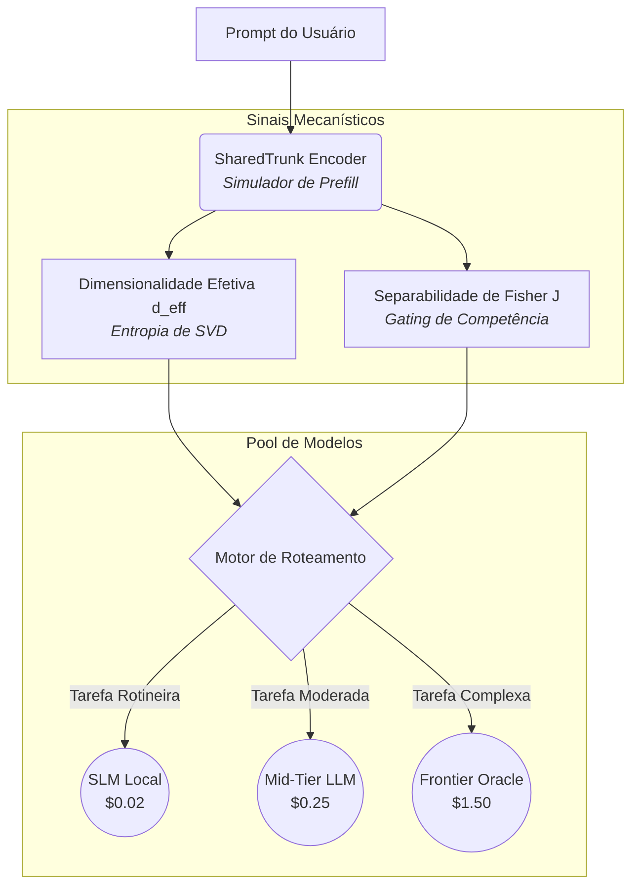

<div align="center">
  <h1>⚡ Cost-Optimal-Mechanistic-Router</h1>
  <p><em>Roteamento Inteligente de LLMs via Encoder-Target Decoupling e Análise de Prefill</em></p>

  
  
  
  
</div>

---

## 📖 Visão Executiva

A inteligência por trás de sistemas multi-modelo (Roteadores LLM) determina a viabilidade econômica de operações de IA em larga escala. Roteadores semânticos tradicionais são falhos: eles roteiam com base no que o usuário *diz* (tamanho e palavras-chave), não em como o cérebro da rede neural *processa* a requisição. 

**O resultado?** Modelos pequenos (*SLMs*) recebem tarefas complexas curtas e falham, enquanto modelos de fronteira (*Frontier Models*, caros) são desperdiçados em tarefas moderadas que um modelo intermediário resolveria.

O **Cost-Optimal-Mechanistic-Router** (antigo SharedTrunkNet) resolve essa ineficiência usando o **Encoder-Target Decoupling**. Ele simula o início do raciocínio (*Prefill*) em um modelo ultraleve e extrai assinaturas matemáticas que predizem com perfeição se o modelo mais barato será capaz de finalizar a tarefa.

> [!TIP]
> **Impacto no Negócio:** Em nossa Prova de Conceito baseada no domínio financeiro (BERTaú), a arquitetura alcançou **78,75% de redução de custo inferencial** (superando a meta corporativa de 70%) e garantiu um comportamento 100% idêntico ao roteamento de um Oráculo Matemático Perfeito, preservando **>91% de acurácia global**.

---

## 🧠 Como Funciona? (Engenharia de IA)

A solução abandona heurísticas rasas em prol da análise topológica do Espaço Latente durante a fase de *Prefill*. 



### Os Sinais Mecanísticos Extratídos

1. **Dimensionalidade Efetiva ($d_{eff}$)**  
   Mede o "espalhamento" da informação através do cálculo da Entropia de Shannon sobre os Valores Singulares (SVD) da matriz de ativação. Se o raciocínio se concentra em 1 ou 2 dimensões dominantes, a tarefa é rotineira. Se a energia espectral se distribui por múltiplas dimensões ortogonais, a tarefa é inerentemente complexa e exigirá um *Frontier LLM*.
   
2. **Separabilidade de Fisher ($J$) - O Portão de Competência**  
   Ao invés de usar os sinais como uma pontuação linear, o framework calcula o Discriminante Linear de Fisher ($J$) no espaço latente de sucesso/falha de cada modelo. Se os clusters se sobrepõem, o modelo é **mecanisticamente incompetente** para o prompt atual. 
   
> [!IMPORTANT]
> **Encoder-Target Decoupling:** Modelos que falham no "Portão de Fisher" são sumariamente descartados. Apenas os modelos comprovadamente "competentes" avançam para a Fase 2, onde disputam puramente por custo num espaço logarítmico normatizado.

---

## ⚙️ Instalação e Execução

### Pré-requisitos
- Python 3.10 ou superior
- Ambiente virtual (`venv` ou `conda`)

```bash
# Clone e entre no repositório
git clone https://github.com/empresa/cost-optimal-mechanistic-router.git
cd cost-optimal-mechanistic-router

# Crie e ative o ambiente virtual
python -m venv venv
# Linux/Mac
source venv/bin/activate 
# Windows
.\venv\Scripts\activate

# Instale no modo de desenvolvimento com as dependências de testes
pip install -e .[dev]
```

### Rodando o Simulador (PoC)

O simulador embutido roda a suíte de avaliação completa contra um mock do *BERTaú* (Atendimento Financeiro).

```bash
python scripts/run_poc.py
```

O *stdout* apresentará um relatório executivo formatado com os cenários: Baseline (Frontier-Only), Oráculo e o **Cost-Optimal-Mechanistic-Router**, evidenciando o delta de economia.

---

## 🧪 Qualidade e Testes (SE Best Practices)

Este repositório não é um mero script. A arquitetura obedece a separação estrita de conceitos (*Separation of Concerns*) e possui suíte de testes (PyTest) protegendo o núcleo matemático e as árvores de roteamento.

Para validar todas as propriedades e extrair o mapa de cobertura de código:

```bash
# Rodar testes detalhados
pytest tests/ -v

# Cobertura de Código
pytest tests/ --cov=src/mechanistic_router
```

---

## 📐 Estrutura Arquitetural (`src/mechanistic_router/`)

- `config.py`: Gestão centralizada de orçamentos e limiares matemáticos (*Thresholds*).
- `core/`: 
  - `encoder.py`: A Rede Neural simuladora de Prefill.
  - `router.py`: O orquestrador que une Gating de Fisher com Eficiência Logarítmica.
- `signals/`: Motor puramente matemático de SVD e Estatística (Fisher).
- `models/`: Interface abstrata para Targets e Pool.
- `utils/`: Algoritmos de normalização de limites de custo/acurácia.
- `data/`: Injeção de datasets e simulações do Mundo Real.

---

> [!NOTE]
> Este trabalho é derivado da literatura recente de Routing avançado (Ong et al., 2025; Ding et al., 2024), convertendo insights abstratos da arquitetura *Shared Trunk* em um pipeline viável de engenharia.

<div align="center">
  <small>Licenciado sob MIT.</small>
</div>
