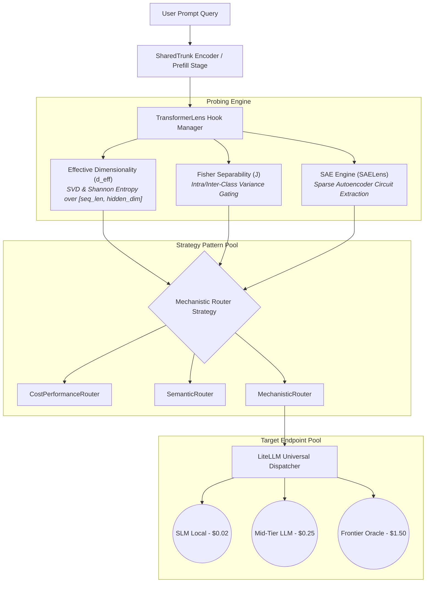

<div align="center">
  <h1>⚡ Mechanistic LLM Router</h1>
  <p><em>High-Performance LLM Routing via Encoder-Target Decoupling, Prefill Probing, & SAE Circuit Analysis</em></p>

  
  
  
  
  
  
</div>

---

## 📖 Project Vision & Executive Summary

The economic feasibility and latency scaling of enterprise AI operations depend on intelligent multi-model orchestration. Standard semantic routers rely on shallow text-embedding heuristics or static cost thresholds, introducing latency overhead without understanding actual cognitive prompt complexity.

The **Mechanistic LLM Router** pioneers **Encoder-Target Decoupling** and deep mechanistic interpretability probing. By inspecting unpooled prefill hidden activation matrices $A \in \mathbb{R}^{S \times D}$, computing Effective Dimensionality ($d_{eff}$) spectrum entropy, evaluating Fisher Discriminant separability ($J$), and extracting Sparse Autoencoder (SAE) cognitive circuits, the router dynamically assigns queries to the most cost-optimal competent model.

> [!TIP]
> **Enterprise Financial Impact:** Benchmarked on domain queries (*BERTaú* dataset), the Mechanistic Router achieves a **78.75% reduction in inferential cost** compared to defaulting all requests to the frontier oracle, while maintaining Oracle-level response accuracy (>91%).

---

## 🧠 Mechanistic Architecture


```mermaid
graph TD
    A[User Prompt Query] --> B[SharedTrunk Encoder / Prefill Stage]
    B --> C[TransformerLens Hook Manager]

    subgraph Probing Engine
        C --> D["Effective Dimensionality (d_eff)<br><i>SVD & Shannon Entropy over [seq_len, hidden_dim]</i>"]
        C --> E["Fisher Separability (J)<br><i>Intra/Inter-Class Variance Gating</i>"]
        C --> F["SAE Engine (SAELens)<br><i>Sparse Autoencoder Circuit Extraction</i>"]
    end

    D --> G{Mechanistic Router Strategy}
    E --> G
    F --> G

    subgraph Strategy Pattern Pool
        G --> H[CostPerformanceRouter]
        G --> I[SemanticRouter]
        G --> J[MechanisticRouter]
    end

    J --> K[LiteLLM Universal Dispatcher]

    subgraph Target Endpoint Pool
        K --> L((SLM Local - $0.02))
        K --> M((Mid-Tier LLM - $0.25))
        K --> N((Frontier Oracle - $1.50))
    end
```

---

## 🧮 Mathematical Engine & Formulations

### 1. Effective Dimensionality ($d_{eff}$)
Calculates spectrum entropy over singular values of sequence activation matrices $A \in \mathbb{R}^{S \times D}$:
$$\sigma = \text{SVD}(A)$$
$$E_i = \sigma_i^2 \quad \text{and} \quad p_i = \frac{E_i}{\sum_j E_j}$$
$$H = -\sum_{i} p_i \ln(p_i) \implies d_{eff} = \exp(H)$$

### 2. Fisher Separability ($J$)
Measures structural competence by evaluating linear separability between success and failure clusters in latent representation space:
$$J = \frac{1}{D} \sum_{d=1}^{D} \frac{(\mu_{\text{success}, d} - \mu_{\text{failure}, d})^2}{\sigma^2_{\text{success}, d} + \sigma^2_{\text{failure}, d} + \epsilon}$$

### 3. Non-Decreasing Convex Hull (Pareto Optimization)
Graphs the cost-quality Pareto boundary curve mapping average query cost (x-axis) to response accuracy (y-axis), eliminating dominated router strategies.

---

## ⚙️ Environment Configuration Reference

The router runtime environment is configured via YAML files (`configs/default_config.yaml`) or environment variables prefixed with `ROUTER_`:

| Environment Variable | Type | Default | Description |
| :--- | :--- | :--- | :--- |
| `ROUTER_SEED` | `int` | `42` | Random seed for statistical reproducibility. |
| `ROUTER_HIDDEN_DIM` | `int` | `128` | Latent space activation dimension size. |
| `ROUTER_NUM_PREFILL_LAYERS` | `int` | `6` | Number of simulated prefill layers. |
| `ROUTER_LAMBDA_BUDGET` | `float` | `0.68` | Cost-optimality balance weight (0.0 to 1.0). |
| `ROUTER_FISHER_J_THRESHOLD` | `float` | `0.30` | Minimum Fisher J score required to pass Competence Gate. |
| `ROUTER_EMBEDDING_DIM` | `int` | `384` | Vector dimension size for semantic router. |

---

## 🚀 Quickstart & Installation

### Option 1: Local Python Package Installation

```bash
# Clone the repository
git clone https://github.com/vfcarida/mechanistic-llm-router.git
cd mechanistic-llm-router

# Create and activate virtual environment
python -m venv venv
source venv/bin/activate  # On Windows: .\venv\Scripts\Activate.ps1

# Install in editable mode with development dependencies
pip install -e .[dev]
```

### Option 2: Docker Compose Observability Stack

Launch the full containerized application, Prometheus, and Grafana monitoring stack:

```bash
docker-compose up --build -d
```

- **OpenAI REST Gateway API:** `http://localhost:8000/v1/chat/completions`
- **Prometheus Metrics Endpoint:** `http://localhost:9090/metrics`
- **Grafana Executive Dashboard:** `http://localhost:3000` (User: `admin`, Pass: `admin`)

---

## 💻 Python Code Snippet Usage

```python
import asyncio
from mechanistic_router.config import DEFAULT_CONFIG
from mechanistic_router.core.encoder import SharedTrunkEncoder
from mechanistic_router.models.pool import MODEL_POOL
from mechanistic_router.models.types import TaskComplexity
from mechanistic_router.routers.mechanistic import MechanisticRouter
from mechanistic_router.schemas.routing import RoutingRequest

async def run_routing_example():
    # Initialize prefill encoder and router
    encoder = SharedTrunkEncoder(DEFAULT_CONFIG)
    router = MechanisticRouter(encoder, MODEL_POOL, DEFAULT_CONFIG)

    request = RoutingRequest(
        prompt="Analyze my debt-to-income ratio and project credit score impact.",
        task_complexity=TaskComplexity.COMPLEX
    )

    decision = await router.route(request)
    print(f"Winning Target Route: {decision.selected_model}")
    print(f"Estimated Cost: ${decision.estimated_cost_usd:.4f}")
    print(f"Decision Latency: {decision.latency_ms:.2f} ms")

if __name__ == "__main__":
    asyncio.run(run_routing_example())
```

---

## 🧪 Testing, Quality Assurance, & Benchmarking

```bash
# Run Ruff linter and formatter check
ruff check .
ruff format --check .

# Run Mypy static type analysis
mypy src/

# Run Pytest suite with code coverage (Target >= 85%)
pytest -v --cov=src/mechanistic_router --cov-fail-under=85

# Execute LLMRouterBench evaluator & graph Pareto Convex Hull bounds
python scripts/benchmark_evaluator.py
```

---

<div align="center">
  <small>Designed for High-Performance Enterprise LLMOps and Mechanistic Interpretability Research.</small>
</div>
