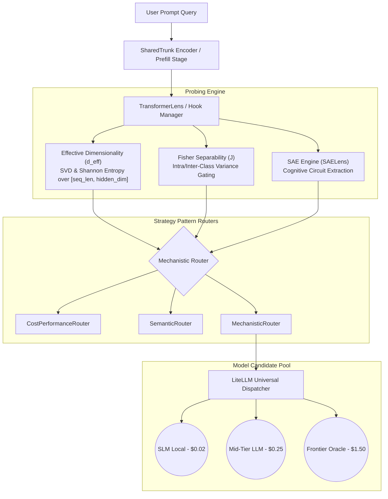

# System Architecture Specification

## Overview

The Mechanistic LLM Router employs a two-stage **Encoder-Target Decoupling** paradigm to minimize inferential costs while maintaining oracle-level response accuracy.

## Mathematical Formulations

### 1. Effective Dimensionality ($d_{eff}$)
$$\sigma = \text{SVD}(A)$$
$$E_i = \sigma_i^2 \quad \text{and} \quad p_i = \frac{E_i}{\sum_j E_j}$$
$$H = -\sum_{i} p_i \ln(p_i)$$
$$d_{eff} = \exp(H)$$

### 2. Fisher Separability ($J$)
$$J = \frac{1}{D} \sum_{d=1}^{D} \frac{(\mu_{\text{success}, d} - \mu_{\text{failure}, d})^2}{\sigma^2_{\text{success}, d} + \sigma^2_{\text{failure}, d} + \epsilon}$$

### 3. Log-Scale Price Selection
$$\text{LogScore} = \frac{\ln(\text{Cost}_{\text{max}} / \text{Cost}_i)}{\ln(\text{Cost}_{\text{max}} / \text{Cost}_{\text{min}})}$$
$$\text{Score}_i = \lambda \cdot \text{LogScore}_i + (1 - \lambda) \cdot \text{AccNorm}_i$$
