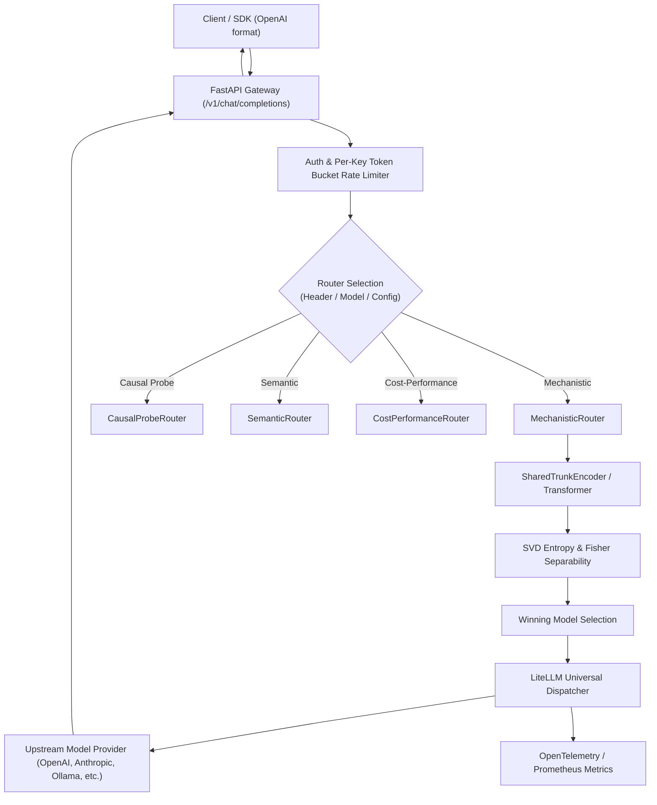

# Mechanistic LLM Router

> [!WARNING]
> **Status: Research/demo artifact.** The router's simulated baseline computes activation quantities (`d_eff`, Fisher J, SAE features) for illustration. Causal probe experiments on real transformer backends (`SmolLM-135M`) are implemented in [`probing/`](file:///c:/Users/vinicius/Documents/GeminiCodes/mechanistic-llm-router/src/mechanistic_router/probing/) and documented in [`MECHANISTIC_SPIKE_REPORT.md`](file:///c:/Users/vinicius/Documents/GeminiCodes/mechanistic-llm-router/docs/MECHANISTIC_SPIKE_REPORT.md).

Welcome to the documentation for **Mechanistic LLM Router**, an open-source research prototype and high-performance API gateway investigating multi-model orchestration via **Encoder-Target Decoupling**, prefill activation inspection, and Sparse Autoencoder (SAE) cognitive circuit analysis.

---

## Key Highlights

- **Encoder-Target Decoupling**: Intercepts unpooled prefill activations $A \in \mathbb{R}^{S \times D}$ from a lightweight shared encoder to estimate query difficulty before invoking expensive frontier models.
- **Mechanistic Signals**:
  - **Effective Dimensionality ($d_{\text{eff}}$)**: SVD entropy across representation layers assessing token dispersion.
  - **Fisher Discriminant ($J$)**: Evaluates candidate model separability across representation clusters.
  - **Linear Activation Probes**: Real layer-wise probes validated by causal ablation against random subspace controls.
- **Drop-in OpenAI Gateway**: FastAPI `/v1/chat/completions` REST server with token-bucket rate limiting, per-key concurrency locking, and payload size validation.
- **Universal Provider Dispatch**: Built on LiteLLM with exponential backoff retries across OpenAI, Anthropic, Bedrock, Vertex, and local Ollama/vLLM endpoints.
- **FinOps & OpenTelemetry Observability**: Real-time Prometheus metrics tracking router latency, endpoint latency deltas, and USD savings compared to frontier oracle models.
- **Rigorous Evaluation Harness**: Paired bootstrap confidence intervals (95% CI), disjoint prompt splits, and Pareto frontier area-under-curve analysis.

---

## Architecture at a Glance

---

## Documentation Navigation

- **[Installation](getting-started/installation.md)**: Environment setup, virtual environments, dependencies, and Docker deployment.
- **[Quickstart](getting-started/quickstart.md)**: Python library walkthrough and running the OpenAI-compatible gateway.
- **[Architecture](architecture.md)**: Comprehensive deep-dive into mathematical foundations and system components.
- **[Causal Probing Guide](guides/causal-probe.md)**: Training linear probes on real transformer models (`SmolLM-135M`) and running causal ablation.
- **[RouterBench Evaluation](guides/routerbench.md)**: Downloading RouterBench and benchmarking against baseline policies.
- **[Baseline Record](BASELINE.md)**: Quality gates, empirical benchmarks, and label leakage inventory.
- **[Mechanistic Spike Report](MECHANISTIC_SPIKE_REPORT.md)**: Empirical report on transformer prefill probing and causal interventions.
- **[Contributing](file:///c:/Users/vinicius/Documents/GeminiCodes/mechanistic-llm-router/CONTRIBUTING.md)**: Development guidelines, PR workflow, and quality gates.
