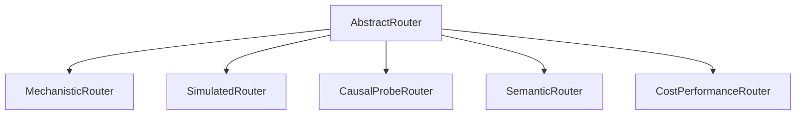

# Routers & Strategy Reference

All routing policies in the Mechanistic LLM Router adhere to the **Strategy Pattern** defined by the `AbstractRouter` interface.

---

## Strategy Hierarchy



---

## 1. `CausalProbeRouter`

**Module**: `mechanistic_router.routers.causal_probe`

The headline production strategy that drives routing decisions through genuine residual-stream activations extracted from local open-weight language models (e.g. `SmolLM-135M`) and evaluated against a trained `LinearActivationProbe`.

### Signature

```python
class CausalProbeRouter(AbstractRouter):
    def __init__(
        self,
        extractor: PrefillActivationExtractor,
        probe: LinearActivationProbe,
        model_pool: dict[str, TargetModel],
        config: RouterConfig = DEFAULT_CONFIG,
        threshold: float = 0.5,
    ) -> None: ...
```

### Methods

- `route(request: RoutingRequest | str) -> RoutingDecision`: Evaluates prompt activation against probe decision hyperplane.
- `save_probe(filepath: str | Path) -> None`: Persists probe weights to compressed `.npz` archive.
- `load_probe(filepath: str | Path) -> None`: Loads probe weights from `.npz` archive into the router.
- `fit(prompts: list[str], labels: list[int] | np.ndarray) -> CausalProbeRouter`: Batch activation extraction and offline probe training.
- `from_saved_probe(...) -> CausalProbeRouter`: Factory method instantiating a router directly from disk checkpoint.

---

## 2. `MechanisticRouter` / `SimulatedRouter`

**Module**: `mechanistic_router.routers.mechanistic`

An exploratory reference strategy computing Effective Dimensionality ($d_{eff}$) spectrum entropy over unpooled sequences, simulated Fisher Discriminant separability ($J$), and Sparse Autoencoder (SAE) feature signals.

### Signature

```python
class MechanisticRouter(AbstractRouter):
    def __init__(
        self,
        encoder: AbstractEncoder,
        model_pool: dict[str, TargetModel],
        config: RouterConfig = DEFAULT_CONFIG,
    ) -> None: ...


# Architectural alias
SimulatedRouter = MechanisticRouter
```

---

## 3. `SemanticRouter`

**Module**: `mechanistic_router.routers.semantic`

A deterministic embedding router classifying user prompts by calculating cosine similarity against domain intent centroids (e.g., balance inquiries, debt renegotiation, complex risk analysis).

### Signature

```python
class SemanticRouter(AbstractRouter):
    def __init__(
        self,
        model_pool: dict[str, TargetModel],
        config: RouterConfig = DEFAULT_CONFIG,
        embedding_fn: Callable[[str], np.ndarray] | None = None,
        centroids: dict[TaskComplexity, np.ndarray] | None = None,
    ) -> None: ...
```

Supports pluggable custom embedding functions (e.g., SentenceTransformers, OpenAI embeddings) or falls back to deterministic UTF-8 hash embeddings.

---

## 4. `CostPerformanceRouter`

**Module**: `mechanistic_router.routers.cost_performance`

A static baseline strategy selecting models based purely on static cost/accuracy trade-off parameter $\lambda$:

$$\text{score}(m) = \lambda \cdot \text{cost\_inv}(m) + (1 - \lambda) \cdot \text{acc}(m)$$

---

## 5. `AbstractRouter`

**Module**: `mechanistic_router.routers.base`

Base abstract class establishing the asynchronous routing contract:

```python
class AbstractRouter(ABC):
    @abstractmethod
    async def route(self, request: RoutingRequest | str) -> RoutingDecision: ...
```
